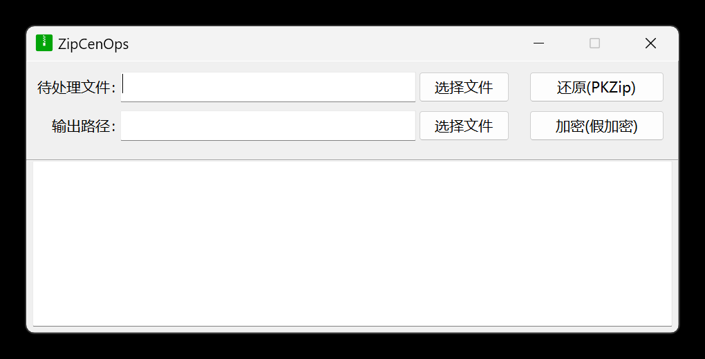

## ZipCenOp

一款使用 Zip 伪加密的 EXE 工具。

原本使用的是大佬通过 Java 实现的工具，使用几次后觉得输入命令麻烦，于是自己实现一个吧。

目前支持的文件选择操作：

1. 将文件拖动至 EXE 图标处
2. 拖动文件至程序内
3. 直接选择文件

### 加解密

解密：
1. 选择待处理文件
3. 点击 【还原】 

加密：
1. 选择待处理文件
3. 点击 【加密】 

### 参考项目

[442048209as/ZipCenOp/CenOp.java](https://github.com/442048209as/ZipCenOp/blob/master/src/zip/CenOp.java)

感谢以上的大佬。
